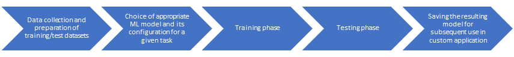
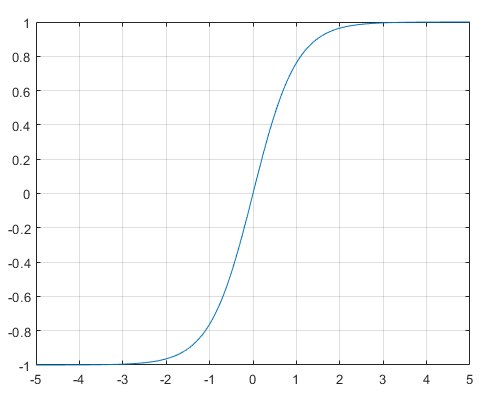
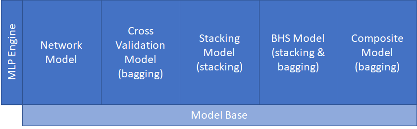
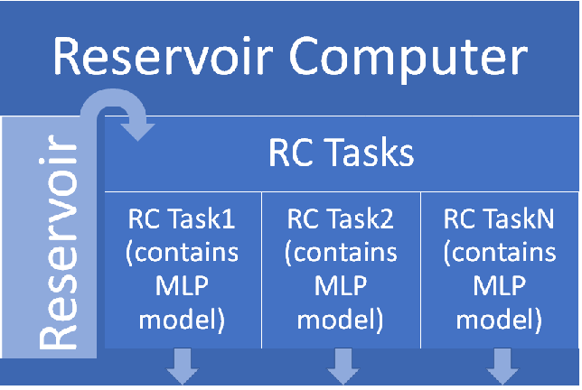

# Machine Learning Library for .NET (EasyML)
This solution is a successor of my [older project](https://github.com/okozelsk/NET). 
Unlike the older solution, there is full [**MLP**](https://en.wikipedia.org/wiki/Multilayer_perceptron) support (many optimizers, standard regularization techniques and types of network models). There is also implemented the [**Reservoir Computer**](https://en.wikipedia.org/wiki/Reservoir_computing), which is now much easier to configure and has a more powerful spike-trace predictor for time series classifications. Overall, the components are much simpler to configure and easier to use than in the older solution. 
The entire solution is written for .net 6 and consists of the main library (**EasyMLCore**) and an educational console application (**EasyMLEduApp**), where it is shown how to work with the library.

## EasyMLCore (namespace EasyMLCore)
The source code of the library is independent on any third party and entire code is written for .net 6.0 in C# 10.
The purpose of this library is to support the usual machine-learning scenario in an easy way.
 

The root namespace contains some common elements such as xsd describing configuration xml(s).
But the main thing it contains is the [EasyML class with its Oper](./EasyMLCore/EasyML.cs) interface, which provides basic functionalities supporting the ML process in a user-friendly way. The EasyML.Oper interface is a singleton. It is immediately usable and its main methods are LoadSampleData, Report, Build and Test. Unless otherwise stated, the methods log the progress of the operation in the system console by default. To redirect logs elsewhere, it is sufficient to set any instance of a custom object implementing the trivial [IOutputLog](./EasyMLCore/Log/IOutputLog.cs) interface using the EasyML.Oper.ChangeOutputLog method.
If you want to write anything of your own to the active log, use the EasyML.Oper.Log.Write method.
 
 
**General characteristics and limitations**
* No GPU utilization, only CPUs
* Common floating point data type is double (not float)
* Every ML model class has associated its own Builder class (or directly contains Build method), which requires appropriate Config class. Every Config class holds model's properties, ensures the basic consistency and has constructor(s) for setup from scratch and also the constructor accepting XElement. Every Config class provides GetXml method
* Almost every component is derived from [SerializableObject](./EasyMLCore/SerializableObject.cs) base class and is easily serializable/deserializable using methods of that base class. Serialization uses the BinaryFormatter
* EasyML does not support the use of distributed resources and is intended for the preparation of models solving small to medium-sized tasks. It is not intended for massive ML tasks with hundreds of thousands of samples
* Supported ML task types are: Categorical (multi-class classification), Binary (single or multiple decisions) and Regression (single or multiple forecasting)

### Activation (namespace EasyMLCore.Activation)
Contains activation functions. Currently implemented [activations](./EasyMLCore/Activation) are: BentIdentity, ElliotSig, ELU, GELU, LeakyReLU, Linear, ReLU, SELU, Sigmoid, Softmax, Softplus, TanH.
 

### Data (namespace EasyMLCore.Data)
Contains data manipulation/evaluation/description components.

|Main content|Description|
|--|--|
|[CsvDataHolder](./EasyMLCore/Data/CsvTools/CsvDataHolder.cs)|Provides easy reading and writing of data in csv format.|
|[SampleDataset](./EasyMLCore/Data/Dataset/SampleDataset.cs)|Implements a set of samples, where each sample holds an input vector and corresponding output vector (vector is a 1D array of double numbers). Component provides samples for Training and Test methods and can be initialized from a CsvDataHolder, another SampleDataset or directly by you, from your custom code.|
|[ResultDataset](./EasyMLCore/Data/Dataset/ResultDataset.cs)|Holds triplets of vectors and usually it is an output from Test methods. Each triplet consists of sample input vector, sample output vector (ideal) and computed vector (computation output of tested model).|
|[TaskErrStat](./EasyMLCore/Data/TaskErrStat)|A set of ML task-specific error statistics holders. Each ML task type has associated its root summary error statistics class, which inherits and/or encapsulates other more granular/detailed error statistics classes.|
|[TaskOutputDetail](./EasyMLCore/Data/TaskOutputDetail)|A set of ML task-specific computed output descriptors. Each ML task type has associated its xxxOutputDetail class, which provides detailed information about computed values (also in textual form).|

### MLP (namespace EasyMLCore.MLP)
Contains MLP engine and MLP models. The mutual relationship is shown schematically in the following figure and will be described in more detail below.

|Main content|Description|
|--|--|
|[MLPEngine](./EasyMLCore/MLP/Engine/MLPEngine.cs)|Implements MLP, a classical fully connected Feed Forward network that may or may not have hidden layers. A [Trainer](./EasyMLCore/MLP/Engine/Trainer.cs) component is dedicated to the MLPEngine. Trainer in iterations (epochs) modifies the weights so that the outputs of the network are as close as possible to the expected outputs. The trainer can be instructed to try to train the network several times from the beginning (attempts). This is mainly due to the random nature of the initialization of the network weights, where repeating with a different initial setting of the weights increases the chance of finding the optimum. The trainer ensures packaging of training data (mini-batches or BGD). As part of the training iteration, it applies the set of required [regularization techniques](./EasyMLCore/MLP/Engine) and calculates the gradients, subsequently modifies the weights using one of the [implemented optimizers](./EasyMLCore/MLP/Engine/Optimizer), and finally modifies the weights if any regularization post-rules are set. The implemented regularizations are: Dropout, L1, L2, WeightsNorm, ClassBalancedLoss, GradClipVal and GradClipNorm.|
|[NetworkModel](./EasyMLCore/MLP/Model/Network/NetworkModel.cs)|Encapsulates the MLPEngine. It has dedicated [NetworkModelBulder](./EasyMLCore/MLP/Model/Network/NetworkModelBuilder.cs), which uses Trainer component and adds functionality such is keeping the best MLPEngine produced during the training attempts/epochs and early stopping.|
|[CrossValModel](./EasyMLCore/MLP/Model/Network/NetworkModel.cs)|Implements the cross-validated model. It has dedicated [CrossValModelBulder](./EasyMLCore/MLP/Model/CrossVal/CrossValModelBuilder.cs), which uses NetworkModelBuilder to build N NetworkModel(s), where each is trained on different training and validation datasets. In addition to the network configuration, the "fold ratio" is specified, which determines what part of the available training data will be used for the "validation fold". In other words, before starting the build process, available training data is divided into N folds. For each NetworkModel, one different fold is designated for validation and the rest for training. The CrossValModel finally works by letting all inner NetworkModel(s) perform the calculation and the final result is a weighted average (bagging). Average is weighted according to the confidence metrics achieved by the NetworkModel(s) in the build process.|
|[StackingModel](./EasyMLCore/MLP/Model/Stacking/StackingModel.cs)|Implements the stacking model, which is a stack of several trained NetworkModel(s), the results of which are combined by the meta-learner. Meta-learner can be any MLP model. StackingModel has dedicated [StackingModelBulder](./EasyMLCore/MLP/Model/Stacking/StackingModelBuilder.cs), which uses NetworkModelBuilder to build stack members (weak/strong), from the weak members outputs on hold-out folds prepares training data for meta-learner and then uses the appropriate xxxBuilder to build the meta-learner. Weak stack members are temporary and they are wiped out during the build process. Meta-learner combines outputs from strong stack members and it's output is the final output of StackingModel.|
|[CompositeModel](./EasyMLCore/MLP/Model/Composite/CompositeModel.cs)|Implements the composite model, which is a cluster of several trained MLP Model(s), the results of which are weighted. CompositeModel has dedicated [CompositeModelBulder](./EasyMLCore/MLP/Model/Composite/CompositeModelBuilder.cs), which builds inner MLP models one by one using appropriate xxxBuilders. The CompositeModel finally works by letting all inner MLP models perform the calculation and the final result is a weighted average (bagging). Average is weighted according to the confidence metrics achieved by the models in the build process.|

### TimeSeries (namespace EasyMLCore.TimeSeries)
Contains implementation of recurrent reservoir and the Reservoir Computer.
Reservoir is a classic ESN, but here with one unique essential feature. This is the ability of an analog neuron to spike in relation to the dynamics of changes in its activation. The Reservoir implemented here is therefore an ESN lightly combined with an LSM. The spikes of the analog neuron are used to generate its SpikesFadingTrace predictor. These predictors dramatically improve time series classification (low reservoir resources - high accuracy) and are what I contribute to Reservoir Computing.
 
The Reservoir Computer is shown schematically in the following figure. The mutual relationship of the components will be described in more detail within the description of the individual components. 

The detailed description is being worked on and will be added gradually and as soon as possible.

## EasyMLEduApp (namespace EasyMLEduApp)
Contains a small console application, where is shown how to work with EasyMLCore. Application has no startup parameters and walking through examples is solved as the menu.
Examples are divided into two main parts. The first one shows usage of MLP models (here is recommended to start) and the second shows usage of Reservoir Computer.
Application uses datasets stored in Data sub-folder. Datasets are in csv format and each dataset has associated text file describing it (just for information). Application writes serialization data to Temp sub-folder.
