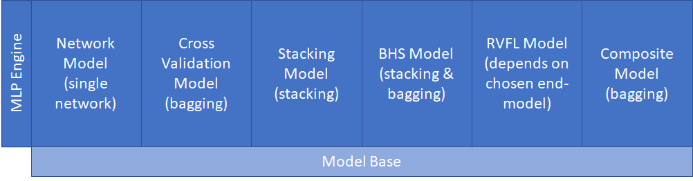
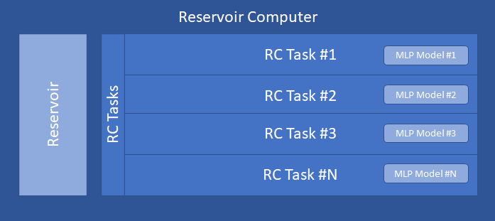

# Machine Learning Library for .NET (EasyML)
The EasyML library offers [**MLP**](https://en.wikipedia.org/wiki/Multilayer_perceptron) models (including [RVFL model](https://en.wikipedia.org/wiki/Extreme_learning_machine)) for common ML tasks as well as [**Reservoir Computer**](https://en.wikipedia.org/wiki/Reservoir_computing) for efficiently solving ML tasks on time series data.
The RC Reservoir implementation is unique here and provides a very effective predictor for classification tasks on time series data.
Throughout the solution, emphasis is placed on the simplest possible use.
Repository consists of the main library (**EasyMLCore**) and a small console application (**EasyMLEduApp**), where it is shown in the form of examples how to work with the library.
 

*This repo is a successor of my [older archived repo](https://github.com/okozelsk/NET).*

## EasyMLCore (namespace EasyMLCore)
The purpose is to support the usual machine-learning scenario in an easy way.
 

The EasyMLCore namespace is a root namespace of the library. It contains some common elements but the main thing it contains is the [EasyML class with its Oper](./EasyMLCore/EasyML.cs) interface, which provides basic functionalities supporting the ML process in a user-friendly way. The EasyML.Oper interface is a singleton. It is immediately usable and its main methods are LoadSampleData, Report, Build, Test, DiagnosticTest and DeepTest. Unless otherwise stated, the methods log the progress of the operation in the system console by default. To redirect logs elsewhere, it is sufficient to set any instance of a custom object implementing the trivial [IOutputLog](./EasyMLCore/Log/IOutputLog.cs) interface using the EasyML.Oper.ChangeOutputLog method.
If you want to write anything of your own to the log, simply use the EasyML.Oper.Log.Write method.
 
 
**General characteristics and limitations**
* The source code is not dependent on any third party library and entire code is written for .net 8.0 in C# 12
* No GPU utilization
* Common floating point data type is double (not float)
* Each ML model class provides static method Build, which creates valid and trained instance (there is no public constructors). The Build method always requires an instance of the appropriate Config class. Config class specifies model's properties, ensures the basic consistency and has constructor(s) for setup from scratch and also the constructor accepting XElement. Config class of any type always provides GetXml method
* Each ML model provides a Compute method (respectively the IComputable interface). The method expects a 1D array of doubles on input and returns the result as a 1D array of doubles as well
* Each ML model provides a Test method that computes a test dataset and returns the results along with error statistics
* Each MLP model provides a DiagnosticTest method that checks the results of the main model and all its sub-models on test dataset and returns diagnostic data
* It is not necessary to standardize/normalize the input data in advance. ML models take care of this themselves
* EasyML does not include data preprocessing tools such as filling in missing values in samples
* EasyML does not support the use of distributed resources and is intended for the preparation of models solving small to medium-sized tasks. It is not intended for massive ML tasks with hundreds of thousands of samples
* Supported ML task types are: Categorical (multi-class classification), Binary (single or multiple decisions) and Regression (single or multiple forecasting)
* Almost every component is derived from [SerializableObject](./EasyMLCore/SerializableObject.cs) base class and is easily serializable/deserializable using methods of that base class. Serialization uses the BinaryFormatter which is unfortunately currently obsolete. In .net8 it must be explicitly allowed in application's .csproj. To allow BinaryFormatter put element &lt;EnableUnsafeBinaryFormatterSerialization&gt;true&lt;/EnableUnsafeBinaryFormatterSerialization&gt; into element &lt;PropertyGroup&gt; in your .csproj file. 

### Activation (namespace EasyMLCore.Activation)
Contains activation functions. Currently implemented [activations](./EasyMLCore/Activation) are: BentIdentity, ElliotSig, ELU, GELU, HardLim, LeakyReLU, Linear, RadBas, ReLU, SELU, Sigmoid, Sine, Softmax, Softplus, TanH.
 

### MLP (namespace EasyMLCore.MLP)
Contains EasyML's MLP models. The mutual relationship is shown schematically in the following figure and will be described in more detail below.

|Main content|Description|
|--|--|
|[*MLPEngine*](./EasyMLCore/MLP/Model/Network/MLPEngine.cs)|Implements the core MLP, a classical fully connected Feed Forward network that may or may not have hidden layers. MLPEngine is not intended to be used alone as an end-model, it serves as a core part of NetworkModel descibed bellow. A [Trainer](./EasyMLCore/MLP/Model/Network/Trainer.cs) component is dedicated to the MLPEngine. Trainer in iterations (epochs) modifies the weights so that the outputs of the network are as close as possible to the expected outputs. The trainer can be instructed to try to train the network several times from the beginning (attempts). This is mainly due to the random nature of the initialization of the network weights, where repeating with a different initial setting of the weights increases the chance of finding the optimum. The trainer ensures packaging of training data (mini-batches or BGD). As part of the training iteration, it applies the set of required regularization techniques and calculates the gradients, subsequently modifies the weights using one of the [implemented optimizers](./EasyMLCore/MLP/Model/Network/Optimizer), and finally modifies the weights if any regularization post-rules are set. The implemented regularizations are: Dropout, L1, L2, WeightsNorm, ClassBalancedLoss, GradClipVal and GradClipNorm.|
|[*ModelBase*](./EasyMLCore/MLP/Model/ModelBase.cs)|Common base class of all implemented MLP models. Ensures equal feature availability across MLP models.|
|[NetworkModel](./EasyMLCore/MLP/Model/Network/NetworkModel.cs)|Encapsulates the MLPEngine. NetworkModel's Build method uses Trainer component and adds functionality such is keeping the best MLPEngine produced during the training attempts/epochs and early stopping. Build method requires instance of the [NetworkModelConfig](./EasyMLCore/MLP/Model/Network/NetworkModelConfig.cs) class.|
|[CrossValModel](./EasyMLCore/MLP/Model/Network/NetworkModel.cs)|Implements the cross-validated model. CrossValModel's Build method builds N NetworkModel(s), where each is trained on different training and validation datasets. Configuration contains "fold ratio" parameter, which determines what part of the available training data will be used for the "validation fold". In other words, before starting the build process, available training data is divided into N folds. For each NetworkModel, one different fold is designated for validation and the rest for training. The CrossValModel finally works by letting all inner NetworkModel(s) perform the calculation and the final result is a weighted average (bagging). Average is weighted according to the confidence metrics achieved by the NetworkModel(s) in the build process. Build method requires instance of the [CrossValModelConfig](./EasyMLCore/MLP/Model/CrossVal/CrossValModelConfig.cs) class.|
|[StackingModel](./EasyMLCore/MLP/Model/Stacking/StackingModel.cs)|Implements the stacking model, which is a stack of several trained NetworkModel(s), the results of which are combined by the meta-learner. Meta-learner can be any MLP model. StackingModel's Build method builds stack members (weak/strong NetworkModels), from the weak members outputs on hold-out folds prepares training data for meta-learner and then builds the meta-learner. Weak stack members are temporary and they are wiped out during the build process. Meta-learner combines outputs from strong stack members and it's output is the final output of StackingModel. Build method requires instance of the [StackingModelConfig](./EasyMLCore/MLP/Model/Stacking/StackingModelConfig.cs) class.|
|[*HSModel*](./EasyMLCore/MLP/Model/BHS/HS/HSModel.cs)|Implements a special kind of stacking model, which is a stack of several trained NetworkModel(s), the results of which are combined by the meta-learner. Meta-learner can be any MLP model, except a HSModel. HSModel is not intended to be used alone as an end-model, it serves as a sub-model of BHSModel descibed bellow. HSModel's Build method, in contrast with StackingModel, in addition to training data also expects validation data (it should be 2 equally large data sets). Method builds stack members (NetworkModels) on training data and from their output on validation data builds the meta-learner. Meta-learner combines outputs from stack members and its output is the final output of HSModel. Build method requires instance of the [HSModelConfig](./EasyMLCore/MLP/Model/BHS/HS/HSModelConfig.cs) class.|
|[BHSModel](./EasyMLCore/MLP/Model/BHS/BHSModel.cs)|Implements the hybrid bagging-stacking model. Training dataset is shuffled and splitted into two halfs. First, the [HSModel](./EasyMLCore/MLP/Model/BHS/HS/HSModel.cs) (stacking) is trained, where the first half of the data serves as training data and the second half serves as validation data. Then the roles of the halves are reversed and a second HSModel is trained. This whole thing can be repeated several times (specified by the Repetitions parameter). The output of the BHSModel is then the weighted average of the outputs of the internal HSModels (bagging). Build method requires instance of the [BSHModelConfig](./EasyMLCore/MLP/Model/BSH/BSHModelConfig.cs) class.|
|[RVFLModel](./EasyMLCore/MLP/Model/RVFL/RVFLModel.cs)|Implements the deep RVFL (Random Vector Functional Link) model, which consists of the RVFL preprocessor and any MLP end-model. Like MLP, the RVFL preprocessor consists of one or more fully connected hidden layers. Each hidden layer consists of one or more pools of neurons. Each neuron pool can have set a different activation function, scale factor for weights, and scale factor for biases. Weights and biases are randomly drawn from a uniform distribution and scaled according to specified scale factors. For each pool it can be also specified whether its activations will be used as predictors for the MLP end-model. In addition to the predictors from the pools, the original input vector can also be passed to the MLP end-model. The MLP end-model should be just a simple network without hidden layers or another MLP model composed of such simple networks. Build method requires instance of the [RVFLModelConfig](./EasyMLCore/MLP/Model/RVFL/RVFLModelConfig.cs) class.|
|[CompositeModel](./EasyMLCore/MLP/Model/Composite/CompositeModel.cs)|Implements the composite model, which is a cluster of several trained MLP Model(s), the results of which are weighted. CompositeModel's Build method builds specified inner MLP models one by one. The CompositeModel finally works by letting all inner MLP models perform the calculation and the final result is a weighted average (bagging). Average is weighted according to the confidence metrics achieved by the models in the build process. Build method requires instance of the [CompositeModelConfig](./EasyMLCore/MLP/Model/Composite/CompositeModelConfig.cs) class.|

### TimeSeries (namespace EasyMLCore.TimeSeries)
Contains implementation of [Reservoir](./EasyMLCore/TimeSeries/Preprocessing/Reservoir.cs) and the [Reservoir Computer](./EasyMLCore/TimeSeries/ResComp.cs) to solve ML tasks where input is univariate or multivariate time series.
 
#### Reservoir
Reservoir is a neural preprocessor consisting of hidden recurrent network as is schematically shown in the following figure. Hidden neurons have usually TanH activation.
Reservoir is implemented as a classic ESN, but with one unique essential feature on top, which is the ability of an Hidden neuron to spike in relation to the dynamics of changes in its activation.
Here implemented Reservoir is therefore an ESN lightly combined with a LSM.

***Reservoir configuration***
 
Reservoir has its own [ReservoirConfig](./EasyMLCore/TimeSeries/Preprocessing/ReservoirConfig.cs) class which consists of two parts: [ReservoirInputConfig](./EasyMLCore/TimeSeries/Preprocessing/ReservoirInputConfig.cs) and [ReservoirHiddenLayerConfig](./EasyMLCore/TimeSeries/Preprocessing/ReservoirHiddenLayerConfig.cs).
 
 
*"Variables", "VarSchema", "Feeding" parameters and their relation*
 
These parameters are essential and must be specified in ReservoirInputConfig. They determine how the submitted input will be understood and processed.
 
*"Variables"* parameter simply specifies, how many variables your time series has. Univariate has 1 variable. Multivariate has more than 1 variable. For example if your time series describes evolving of position in space, you have 3 variables (X, Y and Z coordinate) at each time series point.
 
*"Feeding"* parameter has three options: "PatternConstLength", "PatternVarLength" and "TimePoint".
"Pattern..." options mean, that input 1D array of doubles (vector) is a time series and hence it contains several time points. Individual input vector is independent of each other. In that case, Reservoir is always reseted before the next input vector to be processed.
"TimePoint" option means, that input 1D array of doubles (vector) contains data of single time point of time series. So order of the input vectors is important. In that case, Reservoir is never reseted and is continuously evolving.
 
*"VarSchema"* parameter specifies schema of variables organization in an input 1D array of doubles (vector).
This parameter does matter only in case of multivariate "Pattern..." feeding and has two options: "Groupped" and "VarSequence".
"Groupped" option means, that variables of one time point are together (v1[t1]v2[t1]v1[t2]v2[t2]v1[t3]v2[t3],...).
Option "VarSequence" means, that variables of one time point are separated so it looks like noodles (v1[t1]v1[t2]v1[t3]v2[t1]v2[t2]v2[t3],...).
 
 
*"Density"*
 
This parameter is present in both ReservoirInputConfig and ReservoirHiddenLayerConfig.
 
In ReservoirInputConfig *"Density"* specifies, what portion of hidden neurons receive one variable as an input (ie. how many hidden neurons are connected by one input neuron). If you look at the Reservoir figure above, you see, that every input neuron is connected to two hidden neurons. Corresponding value of *"Density"* parameter is in that case 2/12 = 1.667. Default value of this parameter is 1/4.
 
In ReservoirHiddenLayerConfig *"Density"* specifies, how many other hidden neurons to be connected to one hidden neuron. Default value is 1/10.
 
And one more thing. Instead of a fraction, you can enter an integer number. This is then understood as the exact number of neurons.
 
 

*"MaxDelay"*
 
This parameter is present in both ReservoirInputConfig and ReservoirHiddenLayerConfig.
 
It has the same meaning in both configurations. Neurons are connected via synapse supporting delay. Delay is implemented as a FIFO queue on synapse. If the delay is, for example, 10, the synapse first fills its queue with 10 stimuli from the source neuron (=10 computational cycles of the Reservoir), and once the queue is full, it begins to pass stimuli from the queue to the target neuron while it continues to fill the queue with new stimuli. 
This parameter specifies the maximum delay. It is an integer value and the default value is 0, which means no delay. If you specify 1, half of the synapses will have delay 0 and half will have delay 1. If you specify 2, a third of the synapses will have delay 0, a third will have delay 1, and a third will have delay 2. And so on...
 
 

*"Retainment"*
 
This parameter is present only in ReservoirHiddenLayerConfig. It is a fraction between 0 and 1 and specifies, what portion of previous activation hidden neuron retains. Activation = (Retainment * OldActivation) + (1 - Retainment)*NewActivation.
 
Default value is 0, but. This parameter influences Reservoir's memory and dynamics. Depending on your data, it may play key role.
 
 

***Reservoir's output***
 
Each Reservoir's Hidden neuron provides a set of predictors.

|Predictor type|Description|
|--|--|
|Activation|Use it for Regression tasks. It is simply the current activation value of the hidden neuron.|
|Squared Activation|Use it for Regression tasks (together with Activation or alone). It is the current activation value of Hidden neuron squared, but with the preserved sign.|
|Spikes Fading Trace|Use it for Categorical and Binary tasks.The predictor is constructed as a gradually decaying trace of the history of spikes emitted by the Hidden neuron. The predictor is the result of my research and is my main contribution to Reservoir Computing.|

The output of the Reservoir is all the predictors collected from all the hidden neurons as well as the original input to the Reservoir, if feeding mode allows it.
In order to further work with the output, it is divided into sections: Activations, SquaredActivations, SpikesFadingTraces and ResInput.
 
 
*Booting*
 
It happens only in case of "TimePoint" feeding mode.
Reservoir boots several cycles and does not generate predictors. This is so that the predictors are not affected by the initial state of the Reservoir. The number of boot cycles is equal to the number of hidden neurons.
 
 

#### Reservoir Computer
The Reservoir Computer is shown schematically in the following figure. 

The Reservoir Computer connects the Reservoir and usually one ML task (however, there can be any number of simultaneous ML tasks). ML task ([ResCompTask](./EasyMLCore/TimeSeries/ResCompTask.cs)) is an envelope of MLP model. Reservoir Computer routes the relevant output from the Reservoir as an input to the ML task.
Reservoir Computer has its own [ResCompConfig](./EasyMLCore/TimeSeries/ResCompConfig.cs) class, which is required by its Build method. The configuration consists of the Reservoir configuration and one or more [ResCompTaskConfig](./EasyMLCore/TimeSeries/ResCompTaskConfig.cs) configuration(s). ResCompTaskConfig consists of MLP model configuration and also specifies, what output sections from the Reservoir to use as input of the MLP model.

### Data (namespace EasyMLCore.Data)
Contains data manipulation/evaluation/description components.

|Main content|Description|
|--|--|
|[CsvDataHolder](./EasyMLCore/Data/CsvTools/CsvDataHolder.cs)|Provides easy reading and writing of data in csv format.|
|[SampleDataset](./EasyMLCore/Data/Dataset/SampleDataset.cs)|Implements a set of samples, where each sample holds an input vector and corresponding output vector (vector is a 1D array of double numbers). Component provides samples for Build (training) and Test methods and can be initialized from a CsvDataHolder, another SampleDataset or directly by you, from your custom code.|
|[ResultDataset](./EasyMLCore/Data/Dataset/ResultDataset.cs)|Holds triplets of vectors and usually it is an output from Test methods. Each triplet consists of sample input vector, sample output vector (ideal) and computed vector (computation output of tested model).|
|[TaskErrStat](./EasyMLCore/Data/TaskErrStat)|A set of ML task-specific error statistics holders. Each ML task type has associated its root summary error statistics class, which inherits and/or encapsulates other more granular/detailed error statistics classes.|
|[TaskOutputDetail](./EasyMLCore/Data/TaskOutputDetail)|A set of ML task-specific computed output descriptors. Each ML task type has associated its xxxOutputDetail class, which provides detailed information about computed values (also in textual form).|

 

*Expected format of csv files*
 
For MLP models and "Pattern" feeding RC, a headerless file is expected where the data line contains the sample input and output data. The output data can be either at the beginning of the line or at the end of the line. If the task is classification, then each class can be listed separately as a binary value (n classes = n binary columns) or the corresponding class can be expressed as a single number (1...n or 0...n-1). How the data is arranged is specified in the parameters of the EasyML.Oper.LoadSampleData method.
 
For the "TimePoint" feeding RC a file is expected that has a header with all variable names on the first line. This is followed by the data lines. Each data line contains the values of all variables in the time point. The EasyML.Oper.LoadSampleData method takes parameters to specify which variables are to be input to the RC and which are to be regressed (output).

## EasyMLEduApp (namespace EasyMLEduApp)
Contains a small console application (.net 6, C#10), where is shown how to work with EasyMLCore. Application has no startup parameters and walking through examples is solved as the menu.
Examples are divided into two main parts. The first one shows usage of MLP models (here is recommended to start) and the second shows usage of Reservoir Computer.
Application reads datasets stored in Data and LargeData sub-folders.
Datasets in "Data" subfolder are part of the repository so they are copied atomatically.
Datasets in "LargeData" subfolder are not part of the repository and they are have to be downloaded manually from [Dropbox](https://www.dropbox.com/sh/giwl8iee5eafjoo/AADqljqnOHIsgtuttjNgxAJWa?dl=0) and unzipped.
Datasets are in csv format and each dataset has associated text file describing it (just for information).
Application writes serialization data to Temp sub-folder.

#### Some interresting results of Reservoir Computer
|ML Task|Type|Best result|EasyML Reservoir Computer Result|Source code|Comment|
|--|--|--|--|--|--|
|[ICANN/PASCAL2 Challenge: MEG Mind Reading](https://www.researchgate.net/publication/239918465_ICANNPASCAL2_Challenge_MEG_Mind_Reading_--_Overview_and_Results)|Classification|68%|71.52%|[ResCompMindReadingChallenge.cs](./EasyMLEduApp/Examples/ReservoirComputing/ResCompMindReadingChallenge.cs)|Simple configuration using "SpikesFadingTrace" predictors. Challenge Load, Build and Test completed in 44 seconds on RYZEN7 CPU.|

#### Contact
Questions, ideas, suggestions for improvement and other constructive comments are welcome at my email address oldrich.kozelsky@email.cz
